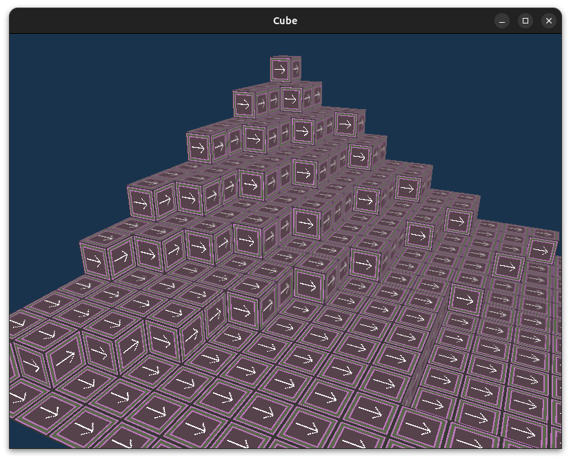

### GameCube
Don't took it seriously, just me playing around OpenGL and Golang.
The game world are composed by chunks and chunks are an wrapper of voxels, that can be uploaded/unloaded
any time to GPU. It has some optimizations but nothing that awe.

### Last state

